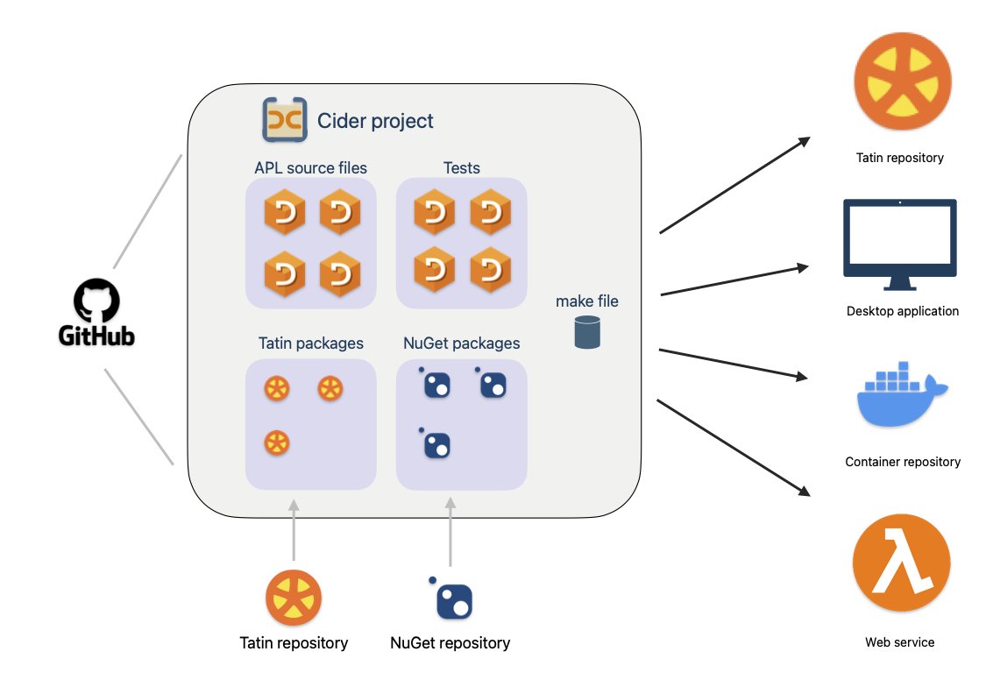

# About Cider

!!! abstract "Cider is a project manager for Dyalog APL."

__If you write software for others to use__ Cider helps you manage

-   the software you publish
-   the files you make it from
-   any imported packages it depends on
-   the versions you produce

## When you open a project

Cider creates its namespace (project space) in the active workspace then

-   defines its APL objects in the project space, linked to their source files
-   loads its Tatin and NuGet packages
-   executes the project’s initialisation function
-   executes your global initialisation function
-   displays the project’s to-do list and Git status

<!-- :fontawesome-solid-hand-point-right: -->
[More details …](open-project.md)

You use Cider through its [user commands](user-commands.md) or its [API functions](api.md).

!!! detail "Related tools"

	Cider cooperates with

	-    [Link](https://dyalog.github.io/link), which maintains the source of Dyalog APL objects as text files
	-    [Tatin](https://tatin.dev), the community APL package manager
	-    [NuGet](https://www.nuget.org), the package manager for .NET
	-    [Git](https://git-scm.com), a source-control manager[^git]
	-    [Dropbox](https://dropbox.com), a file-sharing service

	[^git]: Cider is designed to work with the popular Git source control manager,  but can be used with others.

## Requirements

1.  Dyalog Unicode Edition version 18.2 or better
1.  Your APL source kept in text files
1.  Tatin version 0.116.0 or better

Dyalog v19.0 has Cider and Tatin installed.
For Dyalog v18.2, Cider and Tatin have to be installed.

## Glossary

alias
: A short name for a project, used as an alternative to the project path. Aliases are not case sensitive.

flag
: The meaning depends on context:

	-   In the API or configuration, a boolean; a flag is ‘set’ with 1.
	-   In the user commands, a parameter without a corresponding value: for example in `]CIDER.OpenProject path/2/project -watch`, the `watch` flag is set.

list of strings
: A nested vector of strings, e.g. `'quick' 'brown' 'fox'`

parameter namespace
: A namespace of variables representing parameters

project folder
: Where the project is defined in the filesystem

project space
: The namespace in which Cider builds the project

project path
: The filesystem path to the project folder

string
: A simple character vector, e.g. `'quick'`

## Acknowledgements

Cider is developed from more than a decade of earlier work, primarily by Phil Last and Paul Mansour on the Acre source-code manager.